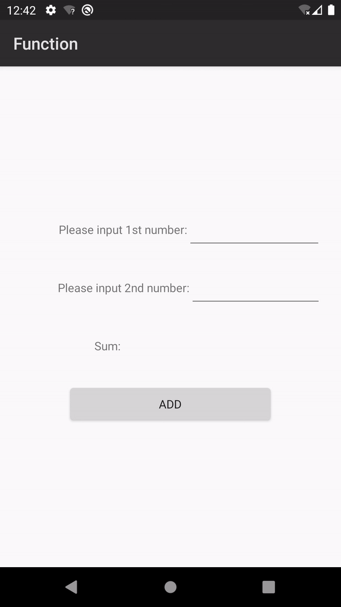

## function quickstart

English | [中文](https://github.com/AppGalleryConnect/agc-demos/blob/main/Android/cloudfunction/README_ZH.md)

## Table of Contents

 * [Introduction](#introduction)
 * [Environment Requirements](#environment-requirements)
 * [Getting Started](#getting-started)
 * [Sample Code](#sample-code)
 * [Result](#result)
 * [Technical Support](#technical-support)
 * [License](#license)

## Introduction
Cloud Functions enables serverless computing. It provides the Function as a Service (FaaS) capabilities to simplify app development and O&M so your ideas can be realized more easily and your service capabilities can be built more quickly.
1. Cloud Functions provides an efficient and reliable framework for developing and running functions. It frees you from complex traditional development and O&M of apps. Server configuration and management, code deployment, load balancing, autoscaling, and high reliability assurance are now streamlined.
You only need to focus on service logic and function code to build reliable and scalable serverless apps.
2. As the core of serverless computing, Cloud Functions works with other cloud services like building blocks to implement your service logic.

## Environment Requirements
* A computer with Android Studio installed for app development
* A device or an emulator in Android Studio running Android 4.2 or a later version

## Getting Started
1. Check whether you have a HUAWEI ID. If not, [register one](https://developer.huawei.com/consumer/en/doc/start/registration-and-verification-0000001053628148) and pass identity verification.
2. Use your account to sign in to [AppGallery Connect](https://developer.huawei.com/consumer/en/service/josp/agc/index.html#/), create an app, and set **Package type** to **APK (Android app)**.
3. Create a [cloud function](https://developer.huawei.com/consumer/en/doc/development/AppGallery-connect-Guides/agc-cloudfunction-introduction-0000001059279544).
3.1 Sign in to AppGallery Connect, click **My projects**, and click the project for which you want to enable Cloud Functions.
3.2 Go to **Build** > **Cloud Functions** and click **Enable now**.
3.3 Click **New Function** on the **Functions** page.
3.4 Define the function on the page that is displayed.
3.5 Click **Save**.
4. Download the **agconnect-services.json** file from AppGallery Connect and copy this file to the app's module directory (for example, **function/app/**.)
Before compiling the APK, make sure that the project includes the **agconnect-services.json** file; otherwise, a compilation error will occur.

## Sample Code
The SDK can call cloud functions and send back the result.
Sample code: src\main\java\com\huawei\agc\quickstart\MainActivity.java

## Result
**Call a cloud function** 

## Technical Support
If you have any questions about the sample code, try the following:
- Visit [Stack Overflow](https://stackoverflow.com/questions/tagged/appgallery-connect), submit your questions, and tag them with `appgallery`. Huawei experts will answer your questions.
- Go to **AppGallery** in the [HUAWEI Developer Forum](https://forums.developer.huawei.com/forumPortal/en/home?fid=0101188387844930001) and communicate with other developers.

If you encounter any issues when using the sample code, submit your [issues](https://github.com/AppGalleryConnect/agc-android-demos/issues) or submit a [pull request](https://github.com/AppGalleryConnect/agc-android-demos/pulls).

## License
The sample code is licensed under the [Apache License, version 2.0](https://www.apache.org/licenses/LICENSE-2.0).
