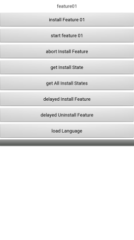

# Dynamic Ability Demo

## Table of Contents

 * [Introduction](#introduction)
 * [Environment Requirements](#environment-requirements)
 * [Getting Started](#getting-started)
 * [Sample Code](#sample-code)
 * [Result](#result)
 * [Technical Support](#technical-support)
 * [License](#license)

## Introduction
The Dynamic Ability SDK is a set of solutions for HUAWEI AppGallery to dynamically load features by referring to the App Bundle technology. After integrating the Dynamic Ability SDK, third-party apps can download features from AppGallery when necessary, thus reducing network traffic and requiring less storage space on devices.
[Read more about the Dynamic Ability SDK](https://developer.huawei.com/consumer/en/doc/development/AppGallery-connect-Guides/agc-dynamicability-introduction-0000001057944549).

## Environment Requirements
Hardware requirements:
1. A computer
2. A Huawei mobile phone

Software requirements:
1. JDK 1.8 or later
2. Android API (level 21 or higher)
3. Android Studio (3.2 or later, Android Studio 3.5 is used as an example).

## Getting Started
Use Android Studio to open the decompressed project. Create a project and an application in AppGallery Connect.

## Sample Code
The Dynamic Ability SDK supports various functions such as downloading and installing a feature, obtaining the installation status, canceling feature installation, and delaying feature installation.

Sample Code: src\main\java\com\huawei\android\dynamicfeaturesplit\SampleEntry.java

## Result
After running the app you should see a screen like this:

## Technical Support
If you have any questions about the sample code, try the following:
- Visit [Stack Overflow](https://stackoverflow.com/users/14194729/appgallery-connect), submit your questions, and tag them with `AppGallery`. Huawei experts will answer your questions.
- Visit the AppGallery section in the [HUAWEI Developer Forum](https://forums.developer.huawei.com/forumPortal/en/home?fid=0101188387844930001) and communicate with other developers.

If you encounter any issues when using the sample code, submit your [issues](https://github.com/AppGalleryConnect/agc-demos/issues) or submit a [pull request](https://github.com/AppGalleryConnect/agc-demos/pulls).

## License
The sample code is licensed under the [Apache License, version 2.0](https://www.apache.org/licenses/LICENSE-2.0).